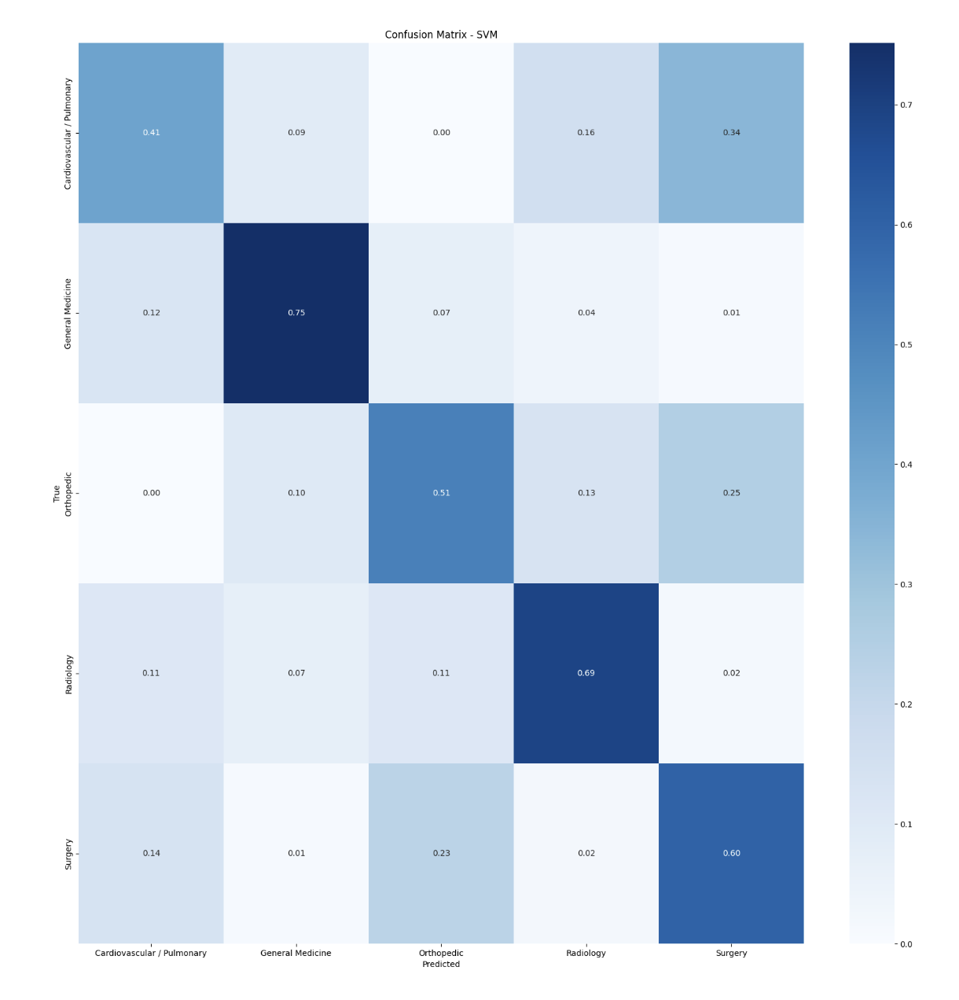

### **NLP for clinical text classification**

## Documents embeddings

This analysis processes and classifies clinical transcriptions by embedding text using a BERT-based model and visualizing them with t-SNE in 2D and 3D. 

## Documents classification with SVM

Dataset has been balanced using SMOTE, and trained multiple classifiers (e.g., logistic regression, SVM) with hyperparameter tuning and GridSearchCV. The results are evaluated using classification reports and confusion matrices.

